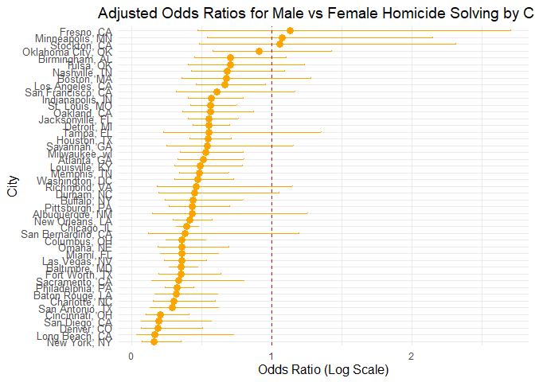
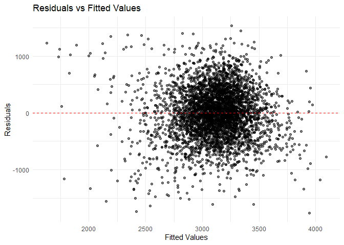

p8105_hw6_tt3022
================
Thomas Tang
2024-12-02

Problem 2

``` r
homicide_data <- read_csv("data/homicide-data.csv", locale = locale(encoding = "latin1"))
```

    ## Rows: 52179 Columns: 12
    ## ── Column specification ────────────────────────────────────────────────────────
    ## Delimiter: ","
    ## chr (9): uid, victim_last, victim_first, victim_race, victim_age, victim_sex...
    ## dbl (3): reported_date, lat, lon
    ## 
    ## ℹ Use `spec()` to retrieve the full column specification for this data.
    ## ℹ Specify the column types or set `show_col_types = FALSE` to quiet this message.

``` r
homicide_data <- homicide_data %>%
  mutate(city_state = paste(city, state, sep = ", "))


homicide_data <- homicide_data %>%
  mutate(solved = ifelse(grepl("Closed", disposition), 1, 0))


omit_cities <- c("Dallas, TX", "Phoenix, AZ", "Kansas City, MO", "Tulsa, AL")
filtered_data <- homicide_data %>%
  filter(!(city_state %in% omit_cities))


filtered_data <- filtered_data %>%
  filter(victim_race %in% c("White", "Black"))


filtered_data <- filtered_data %>%
  mutate(victim_age = as.numeric(victim_age)) %>%
  filter(!is.na(victim_age))
```

I deleted omit cities and remove the unknown value in victim_age

Then I fit a logistic regression model Outcome: resolved (1 = solved, 0
= unsolved) Predictors: victim_age, victim_sex, and victim_race

``` r
baltimore_data <- filtered_data %>%
  filter(city_state == "Baltimore, MD")

fit_logistic <- glm(solved ~ victim_age + victim_race + victim_sex, 
                    data = baltimore_data, 
                    family = binomial())


logistic_results <- summary(fit_logistic)$coefficients %>%
  as.data.frame() %>%
  mutate(
    term = rownames(.),
    OR = exp(Estimate),  # Odds Ratios
    lower_CI = exp(Estimate - 1.96 * `Std. Error`),  # Lower 95% CI
    upper_CI = exp(Estimate + 1.96 * `Std. Error`)   # Upper 95% CI
  ) %>%
  select(term, Estimate, OR, lower_CI, upper_CI, `Pr(>|z|)`)


write.csv(logistic_results, "logistic_results_baltimore.csv", row.names = FALSE)
logistic_results
```

    ##                              term     Estimate        OR  lower_CI  upper_CI
    ## (Intercept)           (Intercept)  0.663791861 1.9421427 1.3795828 2.7341008
    ## victim_age             victim_age -0.005204606 0.9948089 0.9884831 1.0011752
    ## victim_raceWhite victim_raceWhite  0.899713536 2.4588986 1.7268818 3.5012138
    ## victim_sexMale     victim_sexMale -1.036564263 0.3546711 0.2681430 0.4691213
    ##                      Pr(>|z|)
    ## (Intercept)      1.423393e-04
    ## victim_age       1.097901e-01
    ## victim_raceWhite 6.038666e-07
    ## victim_sexMale   3.744216e-13

The odds ratio for victim_sexMale is 0.35, which means the odds of
solving a homicide for male victims are 65% lower compared to female
victims, after adjusting for age and race.

``` r
results <- filtered_data %>%
  group_by(city_state) %>%
  nest() %>%
  mutate(
    model = map(data, ~ glm(solved ~ victim_sex + victim_age + victim_race, 
                            data = ., 
                            family = binomial())),
    or_ci = map(model, ~ {
      
      coef_summary <- summary(.)$coefficients
      log_odds <- coef_summary["victim_sexMale", "Estimate"]
      std_error <- coef_summary["victim_sexMale", "Std. Error"]
      or <- exp(log_odds)
      lower_ci <- exp(log_odds - 1.96 * std_error)
      upper_ci <- exp(log_odds + 1.96 * std_error)
      tibble(
        OR = or,
        lower_CI = lower_ci,
        upper_CI = upper_ci,
        p_value = coef_summary["victim_sexMale", "Pr(>|z|)"]
      )
    })
  ) %>%
  select(city_state, or_ci) %>%
  unnest(cols = or_ci)
```

create plot

``` r
results <- results %>%
  arrange(OR)  


ggplot(results, aes(x = OR, y = reorder(city_state, OR))) +
  geom_point(size = 3, color = "orange") +
  geom_errorbarh(aes(xmin = lower_CI, xmax = upper_CI), height = 0.2, color = "orange") +
  geom_vline(xintercept = 1, linetype = "dashed", color = "red") +
  labs(
    title = "Adjusted Odds Ratios for Male vs Female Homicide Solving by City",
    x = "Odds Ratio (Log Scale)",
    y = "City"
  ) +
  theme_minimal() +
  theme(
    axis.text.y = element_text(size = 10),
    axis.title.x = element_text(size = 12),
    axis.title.y = element_text(size = 12),
    plot.title = element_text(hjust = 0.5, size = 14)
  )
```

<!-- -->

Problem 3:

``` r
birthweight_data <- read.csv("data/birthweight.csv")

# View the structure of the dataset
str(birthweight_data)
```

    ## 'data.frame':    4342 obs. of  20 variables:
    ##  $ babysex : int  2 1 2 1 2 1 2 2 1 1 ...
    ##  $ bhead   : int  34 34 36 34 34 33 33 33 36 33 ...
    ##  $ blength : int  51 48 50 52 52 52 46 49 52 50 ...
    ##  $ bwt     : int  3629 3062 3345 3062 3374 3374 2523 2778 3515 3459 ...
    ##  $ delwt   : int  177 156 148 157 156 129 126 140 146 169 ...
    ##  $ fincome : int  35 65 85 55 5 55 96 5 85 75 ...
    ##  $ frace   : int  1 2 1 1 1 1 2 1 1 2 ...
    ##  $ gaweeks : num  39.9 25.9 39.9 40 41.6 ...
    ##  $ malform : int  0 0 0 0 0 0 0 0 0 0 ...
    ##  $ menarche: int  13 14 12 14 13 12 14 12 11 12 ...
    ##  $ mheight : int  63 65 64 64 66 66 72 62 61 64 ...
    ##  $ momage  : int  36 25 29 18 20 23 29 19 13 19 ...
    ##  $ mrace   : int  1 2 1 1 1 1 2 1 1 2 ...
    ##  $ parity  : int  3 0 0 0 0 0 0 0 0 0 ...
    ##  $ pnumlbw : int  0 0 0 0 0 0 0 0 0 0 ...
    ##  $ pnumsga : int  0 0 0 0 0 0 0 0 0 0 ...
    ##  $ ppbmi   : num  26.3 21.3 23.6 21.8 21 ...
    ##  $ ppwt    : int  148 128 137 127 130 115 105 119 105 145 ...
    ##  $ smoken  : num  0 0 1 10 1 0 0 0 0 4 ...
    ##  $ wtgain  : int  29 28 11 30 26 14 21 21 41 24 ...

``` r
# Convert appropriate numeric variables to factors
birthweight_data <- birthweight_data %>%
  mutate(
    babysex = factor(babysex, labels = c("Male", "Female")),
    frace = factor(frace, levels = c(1, 2, 3, 4, 8), 
                   labels = c("White", "Black", "Asian", "Puerto Rican", "Other")),
    mrace = factor(mrace, levels = c(1, 2, 3, 4, 8), 
                   labels = c("White", "Black", "Asian", "Puerto Rican", "Other")),
    malform = factor(malform, levels = c(0, 1), 
                     labels = c("Absent", "Present"))
  )

# Check for missing values
missing_data_summary <- colSums(is.na(birthweight_data))
print(missing_data_summary)
```

    ##  babysex    bhead  blength      bwt    delwt  fincome    frace  gaweeks 
    ##        0        0        0        0        0        0        0        0 
    ##  malform menarche  mheight   momage    mrace   parity  pnumlbw  pnumsga 
    ##        0        0        0        0        0        0        0        0 
    ##    ppbmi     ppwt   smoken   wtgain 
    ##        0        0        0        0

``` r
model <- lm(bwt ~ gaweeks + delwt + momage + babysex + smoken, data = birthweight_data)


birthweight_data <- birthweight_data %>%
  add_predictions(model, var = "fitted") %>%
  add_residuals(model, var = "residuals")


ggplot(birthweight_data, aes(x = fitted, y = residuals)) +
  geom_point(alpha = 0.5) +
  geom_hline(yintercept = 0, linetype = "dashed", color = "red") +
  labs(
    title = "Residuals vs Fitted Values",
    x = "Fitted Values",
    y = "Residuals"
  ) +
  theme_minimal()
```

<!-- --> A
linear regression model was used because the outcome variable (bwt) is
continuous, and the relationship between the predictors and outcome was
assumed to be linear. The regression model was fitted using the formula:
bwt ~ gaweeks + delwt + momage + babysex + smoken Randomness of
residuals around zero (indicates good fit).

comparing:

``` r
# Define the formulas for the three models
formulas <- list(
  model1 = bwt ~ gaweeks + delwt + momage + babysex + smoken,
  model2 = bwt ~ blength + gaweeks,
  model3 = bwt ~ bhead * blength * babysex  # Includes interactions
)

# Perform Monte Carlo cross-validation
set.seed(123)  # For reproducibility
cv_results <- crossv_mc(birthweight_data, n = 10) %>%
  mutate(
    model1_mse = map2_dbl(train, test, ~ {
      mod <- lm(formulas$model1, data = as.data.frame(.x))
      preds <- predict(mod, newdata = as.data.frame(.y))
      mean((as.data.frame(.y)$bwt - preds)^2)
    }),
    model2_mse = map2_dbl(train, test, ~ {
      mod <- lm(formulas$model2, data = as.data.frame(.x))
      preds <- predict(mod, newdata = as.data.frame(.y))
      mean((as.data.frame(.y)$bwt - preds)^2)
    }),
    model3_mse = map2_dbl(train, test, ~ {
      mod <- lm(formulas$model3, data = as.data.frame(.x))
      preds <- predict(mod, newdata = as.data.frame(.y))
      mean((as.data.frame(.y)$bwt - preds)^2)
    })
  )

# Summarize the results
cv_summary <- cv_results %>%
  summarise(
    model1_mean_mse = mean(model1_mse),
    model2_mean_mse = mean(model2_mse),
    model3_mean_mse = mean(model3_mse)
  )
print(cv_summary)
```

    ## # A tibble: 1 × 3
    ##   model1_mean_mse model2_mean_mse model3_mean_mse
    ##             <dbl>           <dbl>           <dbl>
    ## 1         200553.         112076.          83574.

Model 3 performs the best in terms of predictive accuracy with the
lowest MSE. Model 2 performs better than Model 1, showing that length
and gestational age are significant predictors, even in a simpler setup.
